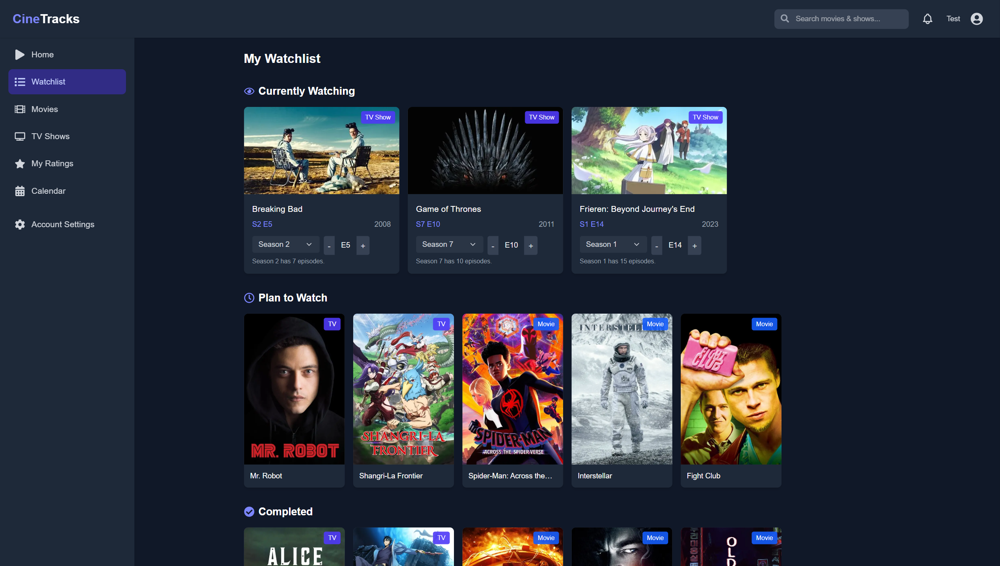

# CineTracks 

<div align="center">
  
  
  
  <!-- <p><i>Your ultimate entertainment companion for tracking movies, TV shows, and anime</i></p> -->
  
  [](LICENSE)
  
  
  
</div>

<br>

## 📌 Overview

**CineTracks** is a comprehensive entertainment tracking platform that brings together movies, TV series, and anime in one elegant application. Say goodbye to juggling multiple apps for different content types—CineTracks provides a unified solution with data from trusted sources, personalized lists, and smart recommendations.

<br>

<div align="center">
  <table>
    <tr>
      <td><b>🔍 Track Everything</b></td>
      <td><b>🌈 Personalize</b></td>
      <td><b>📊 Monitor Progress</b></td>
    </tr>
    <tr>
      <td>Movies, TV shows & anime</td>
      <td>Custom watchlists & categories</td>
      <td>Episode & season tracking</td>
    </tr>
  </table>
</div>

<br>

## ✨ Features

<div>
  
</div>

<br>

- **🔄 Unified Watchlist Management** - Track movies, TV series, and anime all in one place
- **📋 Personalized Categories** - Organize content into "Watched", "Currently Watching", and "Plan to Watch" lists
- **📡 Real-time Data Integration** - Fetch accurate information from trusted sources like TMDB
- **⭐ User Ratings & Reviews** - Rate and review content you've watched
- **📊 Progress Tracking** - Keep track of your watching progress, including episodes for series
- **🧠 Smart Recommendations** - Get personalized content suggestions based on your preferences
- **📱 Responsive Design** - Enjoy a seamless experience across desktop and mobile devices
- **🔒 Secure Authentication** - Protect your account with robust user authentication

<br>

## 🖼️ Screenshots

<div style="display: flex; flex-wrap: wrap; gap: 20px;">
  <div style="flex: 1 1 45%;">
    
    <p style="text-align: center;"><b>Welcome Page</b></p>
  </div>
  <br>
  <div style="flex: 1 1 45%;">
    
    <p style="text-align: center;"><b>Movie Details</b></p>
  </div>
  <br>
  <div style="flex: 1 1 45%;">
    
    <p style="text-align: center;"><b>TV Show Details</b></p>
  </div>
  <br>
  <div style="flex: 1 1 45%;">
    
    <p style="text-align: center;"><b>Personal Watchlist</b></p>
  </div>
</div>

<br>

## 🛠️ Technology Stack

<div align='center'>
  <table>
    <tr>
      <td><b>🔙 Backend</b></td>
      <td><b>🔜 Frontend</b></td>
      <td><b>🧰 DevOps</b></td>
    </tr>
    <tr>
      <td>
        <br>
        <br>
        <br>
        
      </td>
      <td>
        <br>
        <br>
        <br>
        
      </td>
      <td>
        <br>
        <br>
        <br>
        
      </td>
    </tr>
  </table>
</div>

<br>

## 🏗️ Architecture

CineTracks follows a microservices architecture for scalability and maintainability:


<br>

- **Auth Service**: Handles user registration, authentication, and authorization
- **Catalog Service**: Manages movie, TV show, and anime data, integrates with external APIs for content information
- **Watchlist Service**: Manages user watchlists with status tracking and episode progress
- **Frontend Service**: Delivers the user interface and interacts with backend services

<br>

## 🚀 Getting Started

### Prerequisites

- Docker and Docker Compose
- Node.js (v14 or higher)
- Java 11 or higher (for local development)
- Maven (for local development)

<br>

### Quick Start

```bash
# Clone the repository
git clone https://github.com/Snapman5678/CineTracks.git
cd cinetracks

# Set up environment variables
cp .env.example .env
# Edit the .env file with your credentials

# Start the application with Docker Compose
docker-compose up -d
```

<br>

### Access the Application

- **Frontend**: http://localhost:3000
- **API Gateway**: http://localhost:8080

<br>

## 💻 Development Setup

<details>
<summary><b>Backend Development</b></summary>

<br>

```bash
# Auth Service
cd backend/auth-service
./mvnw spring-boot:run

# Catalog Service
cd backend/catalog-service
./mvnw spring-boot:run

# Watchlist Service
cd backend/watchlist-service
./mvnw spring-boot:run
```
</details>

<details>
<summary><b>Frontend Development</b></summary>

<br>

```bash
cd frontend
npm install
npm run dev
```
</details>

<details>
<summary><b>Running Tests</b></summary>

<br>

```bash
# Backend Tests
cd backend/auth-service
./mvnw test

cd backend/catalog-service
./mvnw test

cd backend/watchlist-service
./mvnw test

# Frontend Tests
cd frontend
npm test
```
</details>

<br>

## 📝 Environment Variables

Create a `.env` file with the following variables:

```
POSTGRES_USER=your_db_user
POSTGRES_PASSWORD=your_db_password
POSTGRES_DB=cinetracks
JWT_SECRET=your_jwt_secret
TMDB_API_KEY=your_tmdb_api_key
```

<br>

## 🤝 Contributing

Contributions are always welcome! Please check out our [contribution guidelines](CONTRIBUTING.md) first.

1. Fork the repository
2. Create your feature branch (`git checkout -b feature/amazing-feature`)
3. Commit your changes (`git commit -m 'Add some amazing feature'`)
4. Push to the branch (`git push origin feature/amazing-feature`)
5. Open a Pull Request

<br>

## 📄 License

This project is licensed under the MIT License - see the [LICENSE](LICENSE) file for details.

<br>

## 🙏 Acknowledgements

- [TMDB API](https://www.themoviedb.org/documentation/api) for providing comprehensive movie and TV show data
- All contributors who have helped shape CineTracks

<br>

---

<div align="center">
  <p>Made with ❤️ for entertainment lovers</p>
  <p>
    <a href="https://github.com/Snapman5678/CineTracks/issues">Report Bug</a> · 
    <a href="https://github.com/Snapman5678/CineTracks/issues">Request Feature</a>
  </p>
</div>
